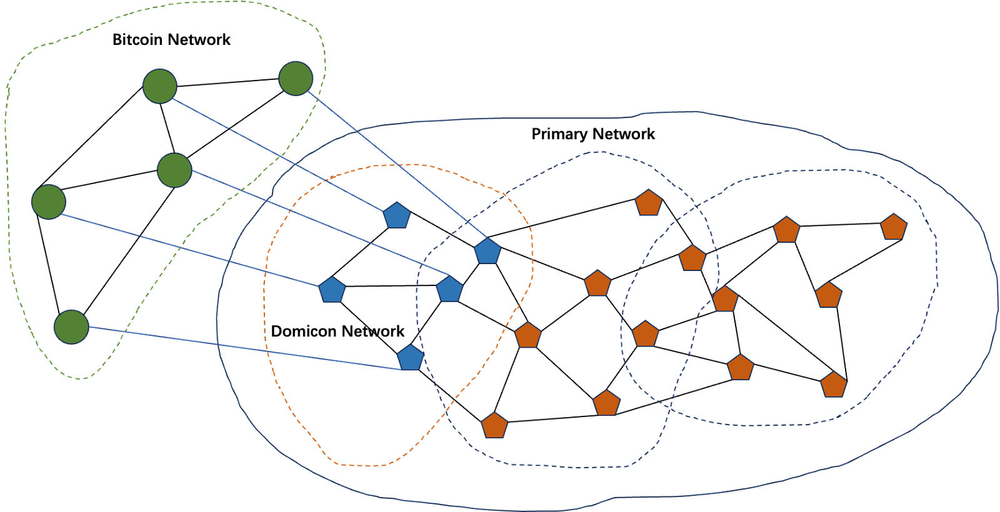

# Domicon:  Native Data Availability Solution for Bitcoin

For a Data Availability (DA) project, the most important aspects are: 

1. determining which data should be stored and;
2. ensuring data is correctly broadcasted and stored, often achieved through penalizing malicious nodes.

## 1.Domicon uses Bitcoin script to determine which data should be stored

 Domicon publishes data commitments to the Bitcoin network in a manner similar to issuing NFTs.

First, users select several Domicon nodes and create a multi-signature address (MNA) based on their addresses.

Then, users create an NFT using protocols like Ordinals or RGB++, where the NFT content is the data commitment, and designate the MNA as the recipient (the first Bitcoin transaction).

Next, users construct a transaction to open the NFT and transfer it from the MNA back to themselves without the MNA’s signature (the second Bitcoin transaction).

Afterward, users send the data to be stored and the second Bitcoin transaction to the corresponding MNA nodes for signing. Upon verifying that the data in the NFT matches the data provided, the nodes sign the transaction and send it back to the users.

Once users collect enough signatures, they send both transactions to the Bitcoin network to wait for confirmation.

Previously, the submission of data commitments was completed. Other nodes in the Domicon network, upon detecting this data commitment in the Bitcoin network, would request the corresponding data in the P2P network. Simultaneously, the MNA-associated nodes ensure that the data is correctly broadcasted and stored in the P2P network.

**Differences compared with Nubit:**

In Nubit's solution, users directly submit data and data commitments to Nubit. After reaching consensus in its network, Nubit uses "Nubit tags" to submit data commitments to Bitcoin.

The problem here is: Who submits the "Nubit tags" to the Bitcoin network? And how is the correctness of the "Nubit tags" verified?

Clearly, this is a typical bridge solution that requires trust that the Nubit-designated nodes will not lie or make errors.

On the other hand, Domicon's approach starts with reaching a consensus between the user and Domicon nodes on data commitments. Then, through two transactions, multi-party signatures (from the user and multiple Domicon nodes) are confirmed by the Bitcoin network via script. This method is safer and more aligned with the Bitcoin network than Nubit.

On the Bitcoin network, Nubit answers which data has already been stored in its network, while Domicon answers which data should be stored in its network.

In terms of user experience for Bitcoin native users, after submitting data to multiple Domicon nodes, users only need to submit the "NFT transaction" to Bitcoin to confirm the data storage action instantly, a process controlled by the users themselves. But with Nubit, after submitting data to Nubit nodes, users must wait for the Nubit network to reach consensus and submit "Nubit tags" to the Bitcoin network to confirm that the data has been saved.

## 2.Domicon utilizes Avalanche network consensus to penalize malicious nodes

Domicon uses KZG-based broadcast proof, data sampling, and data auditing to protect data and detect malicious nodes.

Broadcast proof involves random checks of data within 14 days, requiring nodes to open corresponding random values under the KZG protocol and provide proof.

Data sampling occurs during the data broadcasting process, where nodes request small amounts of data under the protection of the KZG protocol. If a node is found by others to be unable (or unwilling) to provide small data samples, it is reported as a malicious node (the node may pass the broadcast proof but withhold data in the P2P network).

Data auditing refers to users performing batch audits of historical data after multiple data storages with Domicon. Domicon uses an aggregated KZG scheme, achieving 100% auditing of batch data.

The above plans require a consensus network to complete. Bitcoin has the strongest consensus network, but currently, its script computing power is limited and cannot execute such complex algorithms. Thus, Domicon uses a subnet network to borrow Avalanche consensus to penalize malicious nodes. Domicon will implement the above algorithms in the subnet.

Additionally, Domicon requires the subnet to be composed of nodes that have staked BTC.

**Differences compared with Nubit:**

Nubit also needs a consensus network to penalize its malicious nodes. But Nubit uses a self-built Cosmos consensus network, which requires the Nubit community to own and maintain enough decentralized nodes to ensure network security.

Avalanche has been running for six years, and its degree of decentralization and security has been recognized by the community. Borrowing Avalanche's consensus can significantly enhance the security and credibility of the Domicon network.

Moreover, Nubit only employs data sampling to ensure data security. After multiple samplings, this approach can highly likely ensure that some data has been securely stored, but it cannot provide 100% auditing protection for a large volume of historical data.

## 3.Domicon Charges DA Fees on the Bitcoin Network

Because Domicon uses Bitcoin scripts to determine which data should be stored, users can directly complete the payment of fees within the Bitcoin network. Users only need to include the fees within the two Bitcoin transactions that submit their data commitments, and specify Domicon's BTC.b account as the recipient in the second transaction. BTC.b is a trustless, decentralized bridge solution maintained by Avalanche. Thus, the fees will enter the Domicon consensus network via Avalanche's decentralized bridge in the form of BTC.b, completing rewards for the nodes.

 **Differences compared with Nubit:**

Since Nubit's data confirmation is completed outside the Bitcoin blockchain, it requires using the Lightning Network to process payments. When users send fees, they cannot be certain that the data has been securely stored.
