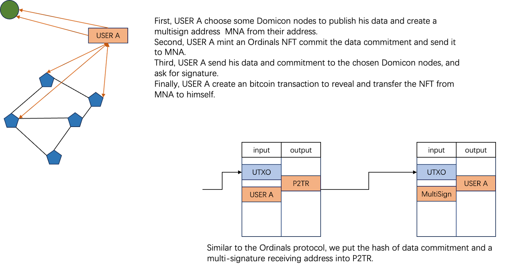

# Domicon:  Native Data Availability Solution for Bitcoin

对于一个DA项目来说，最重要的就是

1.确认哪些数据应该被存储，

2.确认数据被正确的广播和存储，后者往往是通过惩罚恶意节点来实现。

## 1.Domicon使用比特币脚本确认哪些数据应该被存储

Domicon使用类似发布NFT的方式，将数据的承诺发布到比特币网络中。

首先用户先选定几个Domicon的节点，根据他们的地址生成一个生成多签地址MNA。

然后用户采用Ordinals或RBG++等协议，创建一个NFT，NFT的内容就是数据承诺，并指定MNA为接收者（第一笔比特币交易）。

随后用户构造一个打开NFT，并将NFT从MNA转回给自己的比特币交易，但没有MNA的签名（第二笔比特币交易）。

随后用户将要存储的数据和第二笔比特币交易发送给MNA对应的节点，请求签名。节点在收到交易和数据后，对比NFT内的数据承诺和数据进行对比，如果无误，则对交易进行签名，并发送给用户。

用户在收集到足够多的签名后，将第一笔和第二笔交易一起发送到比特币网络等待网络确认。

以往，完成了数据承诺的提交。Domicon网络里面的其他节点，在扫描比特币网络中发现了这个数据承诺以后，就会在P2P网络中去请求该承诺对应的数据。同时MNA对应的节点将作为第一责任人来确保数据能够正确的在P2P网络里广播和存储。

**与Nubit的不同**

在Nubit的解决方案中，用户直接把数据和数据承诺提交给Nubit。然后在自己的网络完成共识以后，Nubit使用“Nubit tags”的方式，将数据承诺提交到比特币。

这里存在的问题是：谁来提交“Nubit tags”到比特币网络？以及如何验证“Nubit tags”的正确性？

显然这是一个典型的桥的方案，需要相信Nubit指定的节点不会撒谎和出错。

而Domicon的做法是，首先用户和Domicon的节点之间就数据的承诺达成共识，然后通过两笔交易的方式达到多方的签名（用户和多个Domicon节点）被比特币网络（通过脚本）确认的效果。显然这种方式，比Nbuit更安全，更接近比特币网络。

在比特币网络上，Nubit回答的是哪些数据已经存储在自己网络中了，而Domicon回答的是哪些数据应该存储在自己网络中。

在用户使用体验上，对于比特币Native的用户来说，用户在将数据提交给Domicon多个节点后，只需再将“NFT交易”提交到比特币，就能第一时间确认数据存储动作完成，这个过程是由用户自己控制时间的。但如果使用Nubit，用户就需要在将数据提交给Nubit节点后，继续等待Nubit网络完成共识，并将“Nubit tags”提交的到比特币网络，才能确认数据被保存了。

## 2.Domicon借用Avalanche网络共识来惩罚恶意节点

Domicon使用基于KZG的广播证明、数据抽样和数据审计来保护数据和发现恶意节点。

广播证明，是对14天内的数据进行抽查，要求节点根据KZG协议打开数据对应的随机值并提供证明。

数据采样，是在数据广播过程中，在KZG协议的保护下，向节点请求小量数据。如果有节点被其他节点发现不能够（或者不愿意）提供小量数据，则该节点会被其他节点举报为恶意节点（该节点有可能通过广播证明，但是在P2P网络中对数据进行了扣留）。

数据审计，是指用户在Domicon多次存储数据以后，对历史数据进行批量的审计。Domicon采用聚合KZG方案，实现了对批量数据的100%审计。

以上方案，需要一个共识网络来完成。比特币最为最强的共识网络，但是目前脚本的计算能力有限，不能够执行这么复杂的算法，因此Domicon通过搭建subnet网络来借用Avalanche共识来实现对恶意节点的惩罚。Domicon将会在subnet中实现以上的算法。

额外的，Domicon会要求subnet由抵押了BTC的节点来组成。

**与Nubit的不同**

Nubit同样需要一个共识网络来惩罚他的恶意节点。但是Nubit采用cosmos自己搭建共识网络，这就需要Nubit社区拥有和维护足够多的去中心化节点，这样才能保证网络的安全。

Avalanche是一个已经运行了6年的网络，其去中心化程度和安全性已经得到了社区的认可。借用Avalanche的共识，可以大大的提升Domicon网络的安全性和可信度。

另外，Nubit只采用了数据采样来确保数据的安全，在多次抽样以后，该方案可以高概率确信某些数据被安全存储了，但无法对大量的历史数据进行100%的数据审计保护。

## 3.Domicon在比特网络上收取存储费用

因为Domicon使用比特币脚本确认哪些数据应该被存储，所以用户可以在比特币网络里直接完成支付费用的动作。

只需要将费用放在用户提交数据承诺的两个比特交易里面，并且在第二笔交易里，将费用指定接收人为Domicon的BTC.b账户即可。BTC.b是Avalanche官方维护的无信任、去中心化的桥方案。这样，费用将通过Avalanche的去中心化桥，以BTC.b的方式进入Domicon共识网络，完成对节点的奖励。

**与Nubit的不同**

因为Nubit的数据确认是在比特币链外完成的，因此他需要采用闪电网络来完成付费：用户在发送费用的时候，是不能确信数据被安全存储了。
