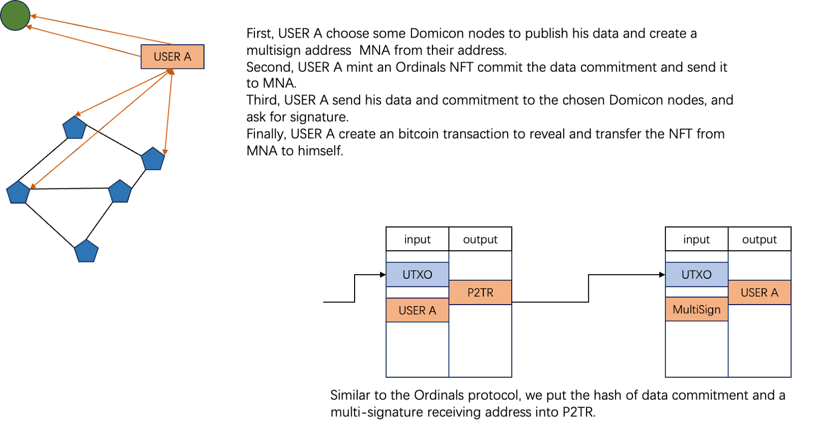

<big>Domicon: Native Data Availability Solution for Multi-Chain

<small>Domicon Tech Ltd.

<small>contact@domicon.xyz
Domicon is building a Data Availability 2.0 layer that provides native multi-chain support. 

It consists of a broadcast layer responsible for data broadcasting and a storage layer responsible for long-term data storage. Domicon's ingenious utilization of the Kate-Zaverucha-Goldberg ( KZG ) polynomial commitment enables data broadcasting, data sampling and aggregate auditing of full data, truly ensuring the integrity and reliability of data in propagation and storage.

# Abstract

We are committed to building a secure and efficient data availability solution for the multi-chain Layer2 ecosystem to meet the growing demands of data publishing, storage, and access. The solution will offer the following advantages:

**1. Native Layer1 Compatibility**

Instead of putting data directly in Layer1, to maximize the security inherited from Layer1, the commitment of data should be stored in layer1, and the data is stored in Domicon nodes.

Our solution is built on the Layer1 base protocol and is compatible with most ecosystem Layer2 solutions, enabling seamless integration with the existing ecosystem and reducing development and usage barriers. 

**2. High-Performance Scalability**

To address the Layer2 scaling needs, we have designed a high-throughput and low-cost solution that can effectively improve data processing efficiency, reduce transaction costs, and promote rapid growth of the Layer2 ecosystem.

**3. Decentralized Data Broadcasting**

A decentralized broadcast network is adopted to distribute data to each node, ensuring data openness and transparency. More people can conveniently read and verify data, which improves data reliability.

**4. 100% Data Audit Mechanism**

Unlike probabilistic auditing schemes, we provide a 100% data audit solution that allows anyone to perform complete data integrity verification, ensuring data security and reliability, preventing data falsification and tampering, and improving data security. Our scheme is based on KZG polynomial commitment, because it supports aggregate verification, so we can easily prove the integrity of multiple data at the same time.

# 1. Background

Over the past two years, Layer 2 solutions, primarily based on Rollup technologies, have gained significant developments. Whether it's Optimistic Rollup or ZK Rollup, numerous outstanding projects have emerged. Bitcoin and Ethereum are the best options for Layer1 because they offer strong consensus capabilities and security.

Rollup, as the most favored scaling solution by users, not only provides faster transaction experiences and lower gas fees but also ensures the security of users' funds through reliable mechanisms, granting Layer 2 solutions a security level nearly on par with Layer 1.

The key technical feature of Rollup involves executing transactions outside of Layer 1 and then submitting the user state roots to Layer 1 block-by-block, taking Layer 1's state root as the final state.

ZK Rollup accompanies the submission of zero-knowledge proofs of state changes when submitting a new state, while Optimistic Rollup derives its security from fraud-proof: if a user detects an incorrect state transition, he/she can raise a challenge, which is adjudicated by the settlement layer i.e. Ethereum.

Additionally, Rollup provides an emergency withdrawal function: when the Rollup project becomes inoperable, users can securely withdraw their funds by proving the ownership of their assets to the Layer 1 state root.

Changes to user states depend on transaction data, and only nodes with access to all transaction data can construct the complete user state tree. This capability is crucial for providing services to users, regardless of regular or emergency withdrawals. Therefore, the broadcasting and storage of transaction data are paramount: data broadcasting keeps nodes in sync with the project's block-producing nodes, and data storage enables nodes to restore the user's latest status from 0 at any given time.

The ability for users or third parties to easily access all transaction data from a Layer2 project, independently recover/replay the Layer 2's final state, and complement the state root submitted on Layer 1 is crucial for safeguarding user funds. This approach prevents situations where ledger errors by the project, for various reasons, could lead to user fund losses.

Hence, whether transaction data is correctly broadcasted to a sufficient number of participants and whether the data is maintained in its entirety will significantly determine the security of a Layer2 project.

## 1.1 Data Publication

The purpose of broadcasting the transaction data of the project is to allow more people to obtain the data and gain the ability to verify the lasted state.

During the data broadcasting process, there may be risks of data loss or malicious withholding by nodes. In other words, it's challenging to prove whether a malicious node has intentionally withheld data subjectively or failed to broadcast it due to network issues or other reasons. For the data receiving nodes, it's also difficult to prove they didn't receive data from a malicious node.

A common solution is to use data sampling, employing erasure coding, to have a sufficient number of light nodes sampling the data. In this way, as long as some of the light nodes are honest, the data can be reconstructed. This approach not only alleviates the network burden caused by transmitting large volumes of data but also prevents nodes from doing evil. Even malicious nodes cannot reject all data adoption requests.

Data broadcasting doesn't require nodes to store data for a long time, but only needs to ensure the success rate of propagating the data within a specified time frame.

## 1.2 Data Storage

Currently, most blockchain projects store data on Ethereum, leveraging the security features the Ethereum network has already established, assuming it won't lose data during propagation and storage. However, this approach is both costly and limiting storage space if all Rollups choose Ethereum as the data storage layer. These constraints don't benefit the unlimited scalability of the Ethereum ecosystem.

Unlike general storage data, Rollup data is dynamically incremental. From a replay perspective, the loss of any data fragment renders the entire dataset invalid. Therefore, when storing this data, it's essential to ensure that the complete dataset is saved. This means that any probabilistic sampling audits become meaningless. Therefore, we need a succinct and deterministic new auditing solution for full data. 

# 2. Overview

In this chapter, we will describe the overall architecture of Domicon. Overall, Domicon is divided into a consensus layer, a broadcast layer, and a storage layer. Unlike the broadcast layer and storage layer, which are composed of independent nodes in the network, the consensus layer is not an independent part, but belongs to Layer1 in part or in whole, so as to maximize the security inheritance of Layer1.

## Consensus Layer

The consensus layer of Domicon is a logical layer.

The main function of the consensus layer is to determine what data should be broadcast and stored by Domicon. And punish dishonest nodes. Dishonest nodes include withholding data, not broadcasting data, not storing data, or tampering with data.

In Domicon's design, the functionality of the consensus layer will be maximized in Layer1. For example, when Ethereum is Layer1, these functions can be implemented in smart contracts. But when bitcoin is Layer1, which data will be broadcast and stored will be recorded on Bitcoin, and the penalty of malicious nodes will be implemented in conjunction with the consensus between trusted nodes.

## Broadcast Layer

The nodes in the broadcast layer will store all data for all projects for 14 days. Therefore, the data is organized according to the time of submission to domicon.

The broadcast node undertakes the two functions of receiving data and broadcasting data.

The project's data will first be submitted to the specified broadcast nodes, and after obtaining the signatures of these nodes, the project will send these signatures and data commitments to the consensus layer.

After the data commitment is acknowledged in the consensus layer, the first broadcast nodes to receive the data will begin to broadcast the data to other broadcast nodes through the P2P network. They are also the first ones responsible for the data: if the majority of broadcast nodes, even with data sampling, cannot obtain the data, then they can initiate punitive measures against the first batch of broadcast nodes, such as slashing.

On the other hand, if the broadcast node does not get the latest data, it will also receive a penalty, which is achieved through broadcast proof: Domicon system will spot check the data within 14 days, and if the broadcast node cannot give the corresponding proof, then he will be punished.

## Storage Layer

The nodes in the storage layer do not store all information, but store data for a long time based on order information.

These long-term stored data will receive an audit from the project, where the audit is deterministic: the project can be confident with 100% probability that the data is properly stored.

# 3. Key Technologies

All data stored to Domicon, is first encoded into a polynomial f(x), and the corresponding KZG commitment $cm$​ is generated. The commitment and polynomials are then uploaded to Domicon.

## KZG Commitment

The KZG commitment, named after its inventors Kate, Zaverucha, and Goldberg, is a form of cryptographic commitment scheme based on elliptic pairings and polynomial. KZG commitments allows one to commit to a polynomial without disclosing it, and later prove properties about the polynomial (such as its value at a certain point) without revealing the entire polynomial. 

You can get more infromation about KZG in the Appendix.

## Proof of Broadcast

Domicon will sample check broadcast nodes to verify if they have retained data from the last 14 days.

The sampling is carried out by the Domicon committee, which randomly selects a storaged commitment and a random value $v$, and then submits them to the contract. The inspected broadcast node is required to submit the proof that the polynomial of the corresponding commitment was opened at $v$.

## Data Audit

When each time the project submits data to Domicon, Domicon records the commitments $cm_i$ corresponding to each data submission and the corresponding polynomials $f_i(x)$. Assuming data has been submitted a total of $t$ times, when the project needs to initiate a full audit, they must generate $t$ random numbers $r_i$ and a random value $v$. The storage provider is then required to open the polynomial $F(x) = \sum r_i \cdot f_i(x)$ at the value $v$.

To facilitate calculations, you can set $r_i = \text{Hash}(seed||i)$, where $seed$ is a seed selected by the project.

The commitment corresponding to $F(x)$ is $CM = \sum r_i \cdot cm_i$. When the value of $t$ is large, it can be challenging to calculate this commitment within the contract. Therefore, an interactive challenge protocol is designed to ensure that the project and the storage provider can reach consensus on $CM$.

First, the project submits $CM_{0,t} = \sum_{i=0}^{t} r_i \cdot cm_i$. If the storage provider disagrees, the project submits $CM_{0,t/2}$ in an interactive binary manner, allowing both parties to find a pair ${CM_{i,j},CM_{i,j+1}}$ that they agree upon $CM_{i,j}$ but not on $CM_{i,j+1}$.

At this point, the contract only needs to verify whether $CM_{i,j+1} = CM_{i,j} + r_{j+1} \cdot cm_{j+1}$. This determination can reveal who is being dishonest, leading to penalties.

Once consensus is reached, the storage node must generate $F(v)$ and its corresponding proof for contract verification.

## Data Sampling

Because each data is encoded into a polynomial $f_i(x)$, and their degree is at most $n$, you only need to know the values of $f_i(x)$ at up to $n+1$ points to reconstruct $f_i(x)$.

So when sampling data, for each data, the sampling party randomly generates up to $(n+1)/16$ values $v_j$ and then requests broadcast nodes to open them at these $(n+1)/16$ points. They provide a commitment Merkle proof, 

$$
[cm_i, [{v_j}, \pi], proof]
$$

for that piece of data. The sampling party first verifies the legality of $cm_i$ based on the Merkle proof and then performs KZG verification.

Because the random space has a size of $2^{256}$, we can assume that the sampling party will not randomly choose the same value twice. Therefore, with just 16 sampling parties, you can obtain the values of $f_i(x)$ at $n+1$ points, ensuring 100% reconstruction of $f_i(x)$​.

# 4. Domicon on Ethereum

## Consensus Layer

On Ethereum, we can implement our consensus layer directly in the smart contract.

The user-submitted $cm$ will be stored in the contract and will be the sole basis for the Domicon node to broadcast or store the data.

Mechanisms such as broadcast proof and data auditing will be implemented in the contract to ensure that domicon fully inherits the Ethereum consensus.

## Submit Commitment to Ethereum

The Layer2 project $A_r$ first encodes and commits the data to obtain $\{data,cm\}$. Then it selects a set of broadcast node and requests to obtain the account address set $\{A_j\}$ of the node. Then the project signs the commitment and the accounts of both parties, and combine the $data$ to obtain
$$
CD=\{[[i,l,cm,\{A_j\},A_r],sign_{A_r}],data\}
$$
where $i$ represents the sequence number of stored data, and $l$ represents the size of $data$. 

The project party sends the combined data $CD$ to the broadcast nodes.

After receiving the combined data $CD$, the broadcast nodes first checks the legality of the signature $sign_{A_r}$, and then checks the legality of the commitment $l,cm,data$. Finally, the broadcast nodes $\{A_k\}$, where $\{A_k\}$ is a subset of $\{A_j\}$, uses its own private key to sign the message, and send back it to the project.

Once the project receive enough signatures, it will create an Ethereum transaction and submit it to Ethereum,
$$
tx([[i,l,cm,\{A_k\},A_r],\{sign_{A_k}\}])_{A_r}
$$
So the project's commitment and broadcast node's signature is sent to the storage contract deployed by Domicon on Ethereum. This means that the broadcast nodes $\{A_k\}$ have received the data from $A_r$ with commitment $cm$.

If, the broadcast nodes read the $cm$ from Ethereum, they will broadcast the data to the P2P network.

When other broadcast nodes obtain the latest $cm$, they will check whether they have the corresponding $data$. If so, they will temporarily store it for 14 days. If not, they will obtain it from other nodes. If all data cannot be obtained from a single node, data sampling can be used to obtain data from multiple nodes and perform combined restoration.

After the storage node has synchronized the latest  $cm$, it will verify whether the data is stored for a long time. If necessary, request synchronized data. If all data cannot be obtained from a single node, data sampling can be used to obtain data from multiple nodes and perform combined restoration.

# 5. Domicon on Bitcoin

## Consensus Layer

We will build the consensus Layer using Avalanche's subnet, and at the same time require all nodes to monitor the Bitcoin network. Users' data commitments will be stored on the Bitcoin network, and the data itself will be broadcast and stored on the subnet network.

When a node discovers a Commitment transaction that complies with Domicon rules on the Bitcoin network, it will write the commitment to the Domicon network store the Commitment locally, and request the corresponding data in the p2p network.

The reason we chose to use Avalanche is that we want to strengthen the security and decentralization of the Domicon network with the help of Avalanche's consensus, and we also require these nodes to stake BTC.

Mechanisms such as broadcast proof and data audit will be implemented in the contract to ensure that domicon fully inherits the Ethereum consensus.

## Submit Commitment to Bitcoin

The commitment submission process is similar to the Ordinals or RGB++ NFT protocol and requires two Bitcoin transactions. The multi-signed addresses of multiple Domicon Broadcast nodes will be treated as the recipient of the first transaction and the sender of the second transaction. The Domicon node is confirmed to have received the user's data by signing multiple addresses.

A brief overview is as follows:

1. The user creates an Ordinals NFT with a commitment to data and sends the transaction to multiple sign-on addresses of multiple Domicon nodes
2. The user sends the data and commitment to the selected Domicon node and requests the transfer NFT signature
3. After the user collects enough signatures, the NFT is transferred back to the user

This completes the submission of the commitment. It is worth noting that these two Bitcoin transactions can be submitted to miner in one go. These two transactions contain the signatures of the user and multiple broadcast nodes to ensure that the user's data has been received by these nodes.

# 6. Conclusion

This article explains in detail the importance of data availability for Layer2 security, and analyzes the two essential pillars for data availability: data publishing and data storage. Domicon pioneers a revolutionary decentralized network architecture, specifically tailored to empower Layer2 project teams with robust, cost-effective data availability solutions. For the Bitcoin and Ethereum ecosystems, Domicon has given detailed solutions that can provide native secure and efficient data availability services for layer2 projects in these ecosystems.

# Appendix: KZG commitment

Kate Zaverucha Goldberg (KZG) commitment is a zero-knowledge (ZK) proof system that allows committing to a polynomial without revealing the entire polynomial.

A commitment is a public value that is bound to the submitter's original message, and it will not disclose the original message. The binding property ensures that the submitter cannot generate the same commitment with data other than the original message, and the hiding property ensures that others cannot retrieve the original message from the commitment.

When the message to be committed is a polynomial, a verifier can complete the verification without knowing the polynomial's coefficients, which is the essence of KZG polynomial commitment. Here, we won't delve into the details of how KZG works but provide an overview of the KZG process, which includes the setup, commitment, proof, and verification stages.

## Setup

Based on the principles of KZG, a trusted setup only needs to yield the following results:

Using a secret $s$ known to nobody, generate two base points of a pairing group as follows:

SRS.PK (for commitment): $s^i\cdot G_1$ and SRS.VK (for verification): $s^i\cdot G_2$

where $i=0,1,2,...,k$. Here, k must be greater than the degree of the polynomial.

## Commit

The Prover holds a polynomial of degree n, denoted as f(x):
$$
f(x)=p_0+p_1x+p_2x^2+...+p_{n-1}x^{n-1}=\sum_{i=0}^{n-1} p_ix^i
$$
Using SRS.PK, the Prover can generate a commitment, denoted as Commitment:
$$
C=f(s)\cdot G_1=\sum_{i=0}^{n-1} p_i\cdot s^i\cdot G_1
$$
The Commitment is a point on the elliptic curve group G1, and its size is independent of n.

## Open

If the Prover holds the correct polynomial, f(x), then for any given z, they can compute the correct f(z) = y and provide a proof.

For the Prover, the calculation is as follows:
$$
f(z)=y
$$
There exists a polynomial:
$$
q(x) ={{f(x)-y}\over x-z}
$$
The Prover can generate a proof, denoted as $\pi$:
$$
\pi = q(s)\cdot G_1
$$
The Prover publicly reveals $y$ and $\pi$.

The generated proof, $\pi$, is a point on the elliptic curve group G1, and its size is independent of n.

## Verify

Upon receiving the proof $\pi$, the Verifier can verify whether $y$ is indeed calculated from the polynomial $f(x)$:
$$
e(\pi ,s\cdot G_2-z\cdot G_2) = e(C-y\cdot G_1,G_2)
$$
If the above equation holds, the verification is successful.

## Batch Open and Verify

KZG polynomial commitments also support opening and verifying batched data. This includes opening multiple points $z_i, i=1,..,t$ for a single polynomial and opening the same point $z$ for multiple polynomials.

For opening multiple points $z_i, i=1,..,t$ for a single polynomial, you need to first calculate two t-degree polynomials, $l(x)$ and $h(x)$, such that:
$$
l(z_i)=f(z_i), i=1,..,t
$$

$$
h(x)=(x-z_1)(...)(x-z_t)
$$

Then, calculate $q(x) = \frac{f(x) - l(x)}{h(x)}$ to obtain the proof $\pi = q(s) \cdot G_1$.

For verification, you only need to verify $e(\pi, h(s) \cdot G_2) = e(C - l(s) \cdot G_1, G_2)$. It is worth mentioning that $l(s)\cdot G_1$ is also a commitment of the polynomial $l(x)$.

When opening the same point $z$ for multiple polynomials $f_i(x)$, you can calculate a new polynomial $F(x) = \sum v_i \cdot f_i(x)$, where $v_i$ are random values. The KZG commitment for $F(x)$ is $\sum v_i \cdot cm_i$. Then, you can proceed with the opening and verification using the original method.