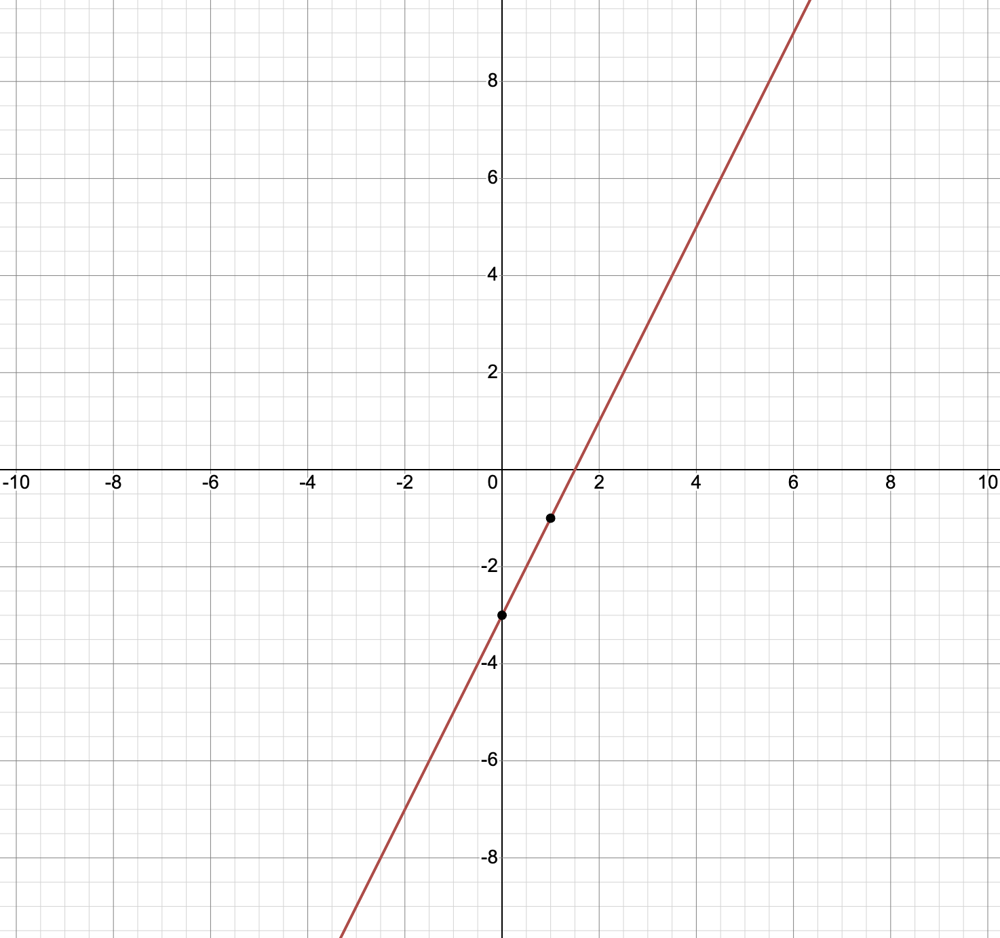
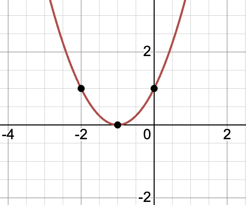

# KZG Polynomial Commitments

This is a brief introduction to the commitment scheme KZG, not a strictly mathematical or cryptographic description.

## Introduction

KZG polynomial commitment, KZG for short, is a scheme that allows a prover to prove the value of a polynomial at any position without giving out the polynomial itself. 

It is like this:

**Prover** :  I have a polynomial $f(x)$, and its commitment is $cm_f$ , now send the $cm_f$ to you.

**Verifier** : Thanks, I get the $cm_f$，can you help to comupte the value of polynomial at the position $a$?

**Prover** : Yes, let me compute $b=f(a)$, and generate a proof $p_a$, and send $b,p_a$ to you.

**Verifier** : Get it! I have check your proof $p_a$ with the commiment $cm_f$, now i know that your are honest, and I can beliver that $b=f(a)$, even though I don't know what $f(x)$​ is. 

## Polynomial

If you have a set of number $(a_0,a_1,...,a_n)$, then you can get a polynomial $f(x):$

$$
f(x)=a_0,a_1x+a_2x^2+...a_nx^n
$$

and the degree of $f(x)$ is $n$.

For example, we have (3, 2), then we get $f(x)=3+2x$, and its degree is 1, we can draw it like this:

it is a line. 

If we have (1, 2, 1), then we get $f(x)=1+2x+x^2$, and its degree is 2, we can draw it like this:

it is a parabola.

We can draw any polynomial on the plane as a curve.

As you may have heard, two points determine a line, and three points determine a parabola. Yes, if we have $n+1$ points, then we can determine a polynomial with degree $n:$

$$
(a_0,f(a_0)),(a_1,f(a_1)),...(a_n,f(a_n))\Longrightarrow f(x)=b_0+b_1x+...+b_nx^n
$$

If we have two polynomial $f(x)=a_0+a_1x+...a_nx^n$ ,  $p(x)=b_0+b_1x+...+b_nx^n$, and a number $c$, then we can have $:$

$$
g(x)=f(x)+p(x)=(a_0+b_0)+(a_1+b_1)x+...+(a_n+b_n)x^n
$$

$$
t(x)=cf(x)=ca_0+ca_1x+...ca_nx^n
$$

Yes, we can perform any linear combination of polynomials, and it is still a polynomial.

## Data Audit

If you store a piece of data in a server, is there any way to ensure that the data in the server is properly saved and not lost? The simplest way is to ask the server to send all the data back and you can check it again. But this method is too inefficient. Is there an easy way to accomplish this task? In fact, KZG can achieve it very well.

First, you can encode you data to a polynomial $f(x)$, and compute its KZG commitment $cm_f$. You publish the $cm_f$ (send it to Ethereum for example) and send $f(x)$ to polynomial to the server.

Next, you are the **Verifier**, and the server is the **Prover** :

**Verifier** : Can you help to comupte the value of polynomial $f(x)$ at the position $a$ ? If you hold the whole polynomial, it is an easy task. Don't forget submit your proof.

**Prover** : Yes, let me compute $b=f(a)$, and generate a proof $p_a$, and send $b,p_a$ to you.

**Verifier** : Get it! I have checked your proof $p_a$ with the commitment $cm_f$, and now I know that you are honest, and didn't lose my data.

How about if we store some piece of data so that we have a set of polynomial $f_i(x)$? We can use **Aggregate KZG** to audit all the data at once.

At the same, we have the KZG commitment set $cm_{f_i}$ for $f_i(x)$. KZG has a linear feature: the commitment of the polynomial $h(x)=\sum k_if_i(x)$ is $cm_h=\sum k_icm_{f_i}$.

**Verifier** : I have a set $\{k_i\}$, can you help to comupte the value of polynomial $h(x)=\sum k_if_i(x)$ at the position $a$ ? If you hold the whole polynomials, it is an easy task. Don't forget to submit your proof.

**Prover** : Yes, let me first comupte $h(x)=\sum k_if_i(x)$ , then compute $b=h(a)$, and generate a proof $p_a$, and send $b,p_a$ to you.

**Verifier**: Get it! I have checked your proof $p_a$ with the commitment $cm_h=\sum k_icm_{f_i}$, now I know that you are honest, and didn't lose my data.

## Data Sampling

If the data is so large that the network transmission fails, then we need to sample the data.

For example, the server stored the data as a polynomial $f(x)=a_0+a_1x+...+a_{100}x^{100}$ with degree 100. If we want to sample 1/10 of the whole data, we can ask for 10 random point of $f(x):$

$$
(b_0,f(b_0)),(b_1,f(b_1)),...,(b_9,f(b_9))
$$

Don't forget to ask for a KZG proof at the same time to make sure that the server is honest.

If we have 10 shardings of the whole data, then we have 100 points of $f(x)$, then we can rebuild it $:$

$$
(b_{0,0},f(b_{0,0})),(b_{0,1},f(b_{0,1})),...,(b_{0,9},f(b_{0,9}))
$$

$$
(b_{1,0},f(b_{1,0})),(b_{1,1},f(b_{1,1})),...,(b_{1,9},f(b_{1,9}))
$$

$$
...
$$

$$
(b_{9,0},f(b_{9,0})),(b_{9,1},f(b_{9,1})),...,(b_{9,9},f(b_{9,9}))
$$
