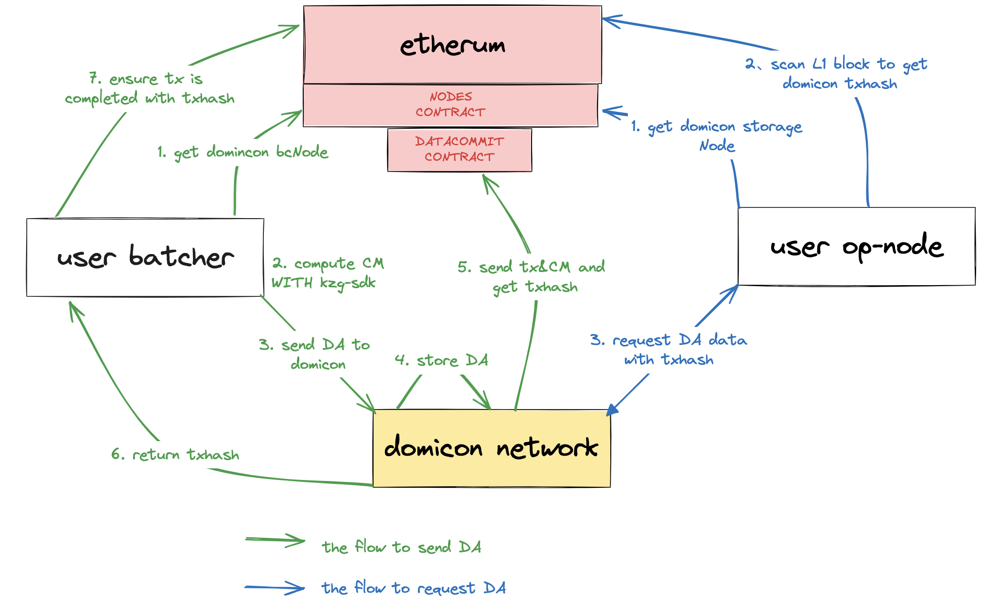
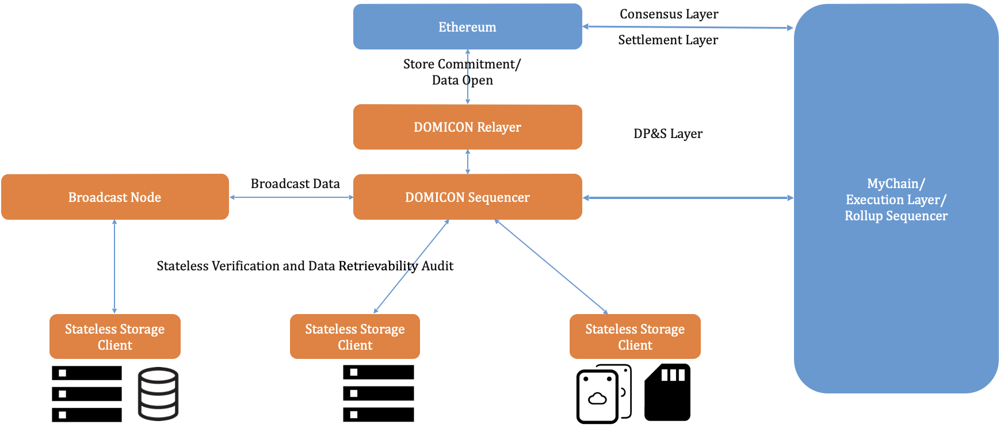
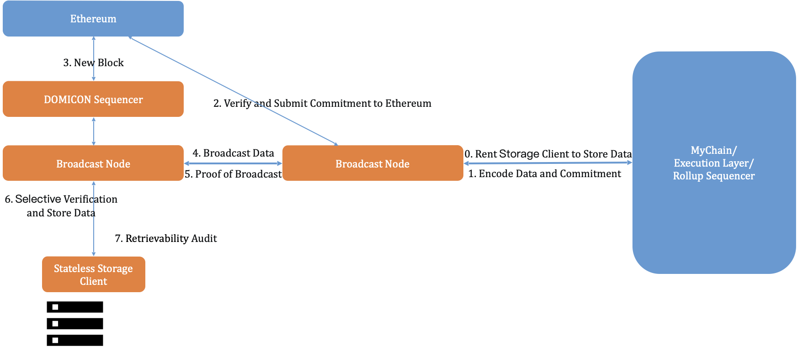

# Domicon

## 1. What is Domicon?

Domicon is an Ethereum bandwidth scaling solution designed to provide secure and efficient **data availability** (DA) services for Layer 2/Rollup ecosystem. It consists of a broadcast layer responsible for data broadcasting and a storage layer responsible for long-term data storage. Domicon's ingenious utilization of the Kate-Zaverucha-Goldberg (KZG) polynomial commitment enables data broadcasting, data sampling and aggregated auditing of full data, truly ensuring the integrity and reliability of data in propagation and storage.

Build Rollup  with Domicon as the DA  layer will get the fastest data confirm experience, the most secure data protection, and the most cost-effective data fees.

## 2. Why is Domicon?

### 2.1 Domicon is the safest

**More secure native bridge**

Most DA projects, such as Celestia, need to bridge the user's storage certificate across the chain to Ethereum to complete the final data confirmation. This increases the security assumptions required to remain honest across chain bridges. In past experience, cross-chain bridges have been easily targeted by hackers. In the DA scenario, hackers can gain the full power of the project sequencer by tampering with DA data, thereby profiting from it, resulting in the loss of user assets.

Domicon itself is built using the Rollup method, with its own native cross-chain bridge, which binds the security of DA and Ethereum, bringing the most secure data confirmation solution to clients.

**The safest way to audit**

How to store data safely and for a long time is a problem that all DA solution providers need to face.

Existing DA projects all claim to use sampling or partial challenge for random audit mode, and then audit the data through multiple challenges to ensure that the data reaches 99% storage security.

But in fact, DA data is different from general data. For example, if a picture loses some pixels, it does not affect the viewing and use of the picture. The purpose of long-term preservation of DA data is to reconstruct the world state for replay, so the loss of any data will cause replay to fail. Therefore, we believe that it is meaningless to conduct random audits on DA data.

Domicon adopts a deterministic audit scheme and uses the KZG aggregation scheme to complete the audit on 10T of data within 1 second and generate a certificate to confirm the security of the data with 100% probability.

### 2.2 Domicon is the fastest

In the known DA layer projects, data and data commitments are processed separately. Generally speaking, the final data commitment will be uploaded to Ethereum, and the data will be saved in the DA layer project's network. The common process is that the project party first stores the data to DA, and after DA confirms receipt of the data, the data commitment and storage certificate are sent to Ethereum to confirm the data.

Domicon adopts an integrated processing solution and encourages broadcast nodes to provide data confirmation services.

Users only need to hand over the data and data commitment to the broadcast node, and the broadcast node will help the user upload the data commitment to Ethereum and return the corresponding txhash to the user.

Users only need to check that the transaction has been confirmed on the Ethereum network, and then the data processing can be completed.

### 2.3 Domicon is the most lightweight

In Domicon's network, we have designed an incentive mechanism to encourage and supervise nodes to provide external services. 

Taking the broadcast node as an example, if it does not undertake the responsibility of broadcasting and does not broadcast data, it's deposited tokens will be slashed; if it provides external data confirmation services, it will receive additional token rewards.

Domicon uses Ethereum as its governance layer, and all governance activities are completed on Ethereum. Therefore, users can obtain the external information of all Domicon broadcast nodes and storage nodes by querying the relevant contracts of Domicon on Ethereum.

In other words, when using Domicon services, there is no need to build your own nodes or use third-party nodes like other blockchain infrastructures.

You only need an Ethereum node to enjoy Domicon services smoothly. Whether you want to build a new rollup using domicon or transfer the existing DA to Domicon, it is an easy task.

## 3. How to build Rollup on Domicon

### 3.1 Use the OP-Stack package provided by Domicon

OP-Stack is a tool suite for building op-rollup launched by the Optimistic team. It uses Ethereum as the DA layer. After being transformed by the Domicon team, it can use Domicon as the DA layer to publish and store data.

With just a few simple instructions, users can easily build an op-rollup using Domicon, saving users 90% of DA fees.

For more detailed information, you can view the construction guide in the [domicon-labs/document](./domiconRollup/Domicon-OP-Stack-EN.md) warehouse on github.

### 3.2 Independent development

If you need to develop a Rollup independently, you can interact with Domicon according to the above steps to save and read DA data.

**Storing Data**

When the Rollup project needs to store data, it can first read the broadcast node information from the node contract on Ethereum and find the node with the best network conditions. The project party then generates the commitment locally and submits the signature to the Domicon broadcast node. After receiving the data and data commitment, the broadcast node broadcasts the data in the Domicon network, submits the data commitment to Ethereum and obtains txhash. The broadcast node returns txhash to the project side. After receiving the txhash, the project party goes to the Ethereum network to check. If the transaction is confirmed, the data confirmation is achieved.

**Reading data**

When the Rollup project needs to read DA data and replay to reconstruct the world state, the project side first reads the storage node information from the node contract on Ethereum and looks for the node with the best network conditions. The project party then scans the block and parses it to obtain the corresponding data commitment and txhash, and takes the commitment or txhash to the Domicon storage node to read the DA data and then process it.

For more detailed information, you can view the construction guide in the [domicon-labs/document](./domiconRollup/publishDA-EN.md) warehouse on github.

## 4. How Domicon Works?

Domicon is a data availability solution for the Ethereum ecosystem, providing secure and efficient data availability services to Layer 2 projects based on Ethereum. It helps projects seamlessly integrate into the Ethereum ecosystem in the form of Rollups.

### 4.1  Network Topology

Domicon will exist as a Rollup, using Ethereum as the consensus and data availability layer. Different from execution layer rollups such as Optimistic or ZkSync, Domicon can be regarded as Ethereum's bandwidth and storage rollup solution.

Domicon consists of two layers: the broadcast layer responsible for data broadcasting, and the storage layer responsible for long-term data storage.

In Domicon's broadcast layer, user data is not stored for the long term. Only data commitments are retained for an extended period. User data is deleted approximately three days later, but this does not affect data broadcasting. To prevent broadcast nodes from withholding data, apart from the overall broadcast of data, Domicon also supports the broadcasting nodes to obtain data through data sampling, and reassemble the original data after receiving sampled data from other P2P nodes.

In Domicon's storage layer, storage nodes only retain the data of the employers’ for the long term. To reduce the load on Domicon storage nodes, these nodes do not need to maintain the entire Domicon state, they only need to validate and store employer transactions. To ensure storage reliability, storage nodes accept full data audit challenges from employers, and only nodes that have successfully completed the challenge receive storage rewards.

### 4.2 Work Flow

0. Domicon community members become broadcast nodes and storage nodes by staking tokens. The Rollup project party selectively rents storage nodes within the Domicon network.

1. The project party encodes and commits the data to be stored, and sends the data and commitment together to a Domicon broadcast node

2. After receiving the data and commitment, the Domicon broadcast node first checks the legality of the commitment, then sends the commitment to Ethereum Layer1 and broadcasts the user data.

3. After Domicon reads the commitment from Ethereum, it creates a system transaction and packages it into the Domicon block, and uploads the latest block state to Ethereum to realize consensus and settlement.

4. Domicon’s broadcast node starts broadcasting or sampling data, and deletes expired data.

5. The Domicon Management Committee will launch broadcast proof challenges to broadcast nodes from time to time to ensure that the data is broadcasted.

6. The Domicon storage node saves the data of its employer.

7. The employer project party regularly initiates full data audits and requires storage nodes to complete verification before they can receive rewards.

## 5. What is Data Availability ?

Data avilability is a key component in ensuring the security of Layer2 user funds. Only if the data avilability is sufficiently guaranteed can we say that Layer2 inherits the security of Layer1. Data Avilability can help the validator node to verify the latest status of the project in time, and can also help the third party to independently replay and rebuild the project status, acting as the last firewall for the security of user funds.

Hence, whether transaction data is correctly broadcasted to a sufficient number of participants and whether the data is maintained in its entirety will significantly determine the security of a Rollup project.

### 5.1 Data Publication

The purpose of broadcasting the transaction data of the project is to allow more people to obtain the data and gain the ability to verify the lasted state.

During the data broadcasting process, there may be risks of data loss or malicious withholding by nodes. In other words, it's challenging to prove whether a malicious node has intentionally withheld data subjectively or failed to broadcast it due to network issues or other reasons. For the data receiving nodes, it's also difficult to prove they didn't receive data from a malicious node.

A common solution is to use data sampling, employing erasure coding, to have a sufficient number of light nodes sampling the data. In this way, as long as some of the light nodes are honest, the data can be reconstructed. This approach not only alleviates the network burden caused by transmitting large volumes of data but also prevents nodes from doing evil. Even malicious nodes cannot reject all data adoption requests.

Data broadcasting doesn't require nodes to store data for a long time, but only needs to ensure the success rate of propagating the data within a specified time frame.

### 5.2 Data Storage

Currently, most blockchain projects store data on Ethereum, leveraging the security features the Ethereum network has already established, assuming it won't lose data during propagation and storage. However, this approach is both costly and limiting storage space if all Rollups choose Ethereum as the data storage layer. These constraints don't benefit the unlimited scalability of the Ethereum ecosystem.

Unlike general storage data, Rollup data is dynamically incremental. From a replay perspective, the loss of any data fragment renders the entire dataset invalid. Therefore, when storing this data, it's essential to ensure that the complete dataset is saved. This means that any probabilistic sampling audits become meaningless. Therefore, we need a succinct and deterministic new auditing solution for full data like Domicon.